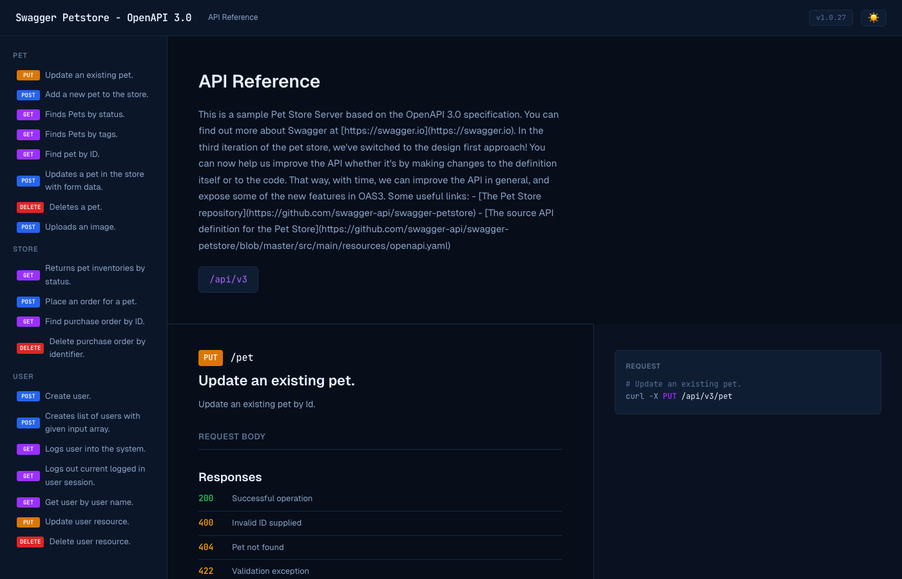
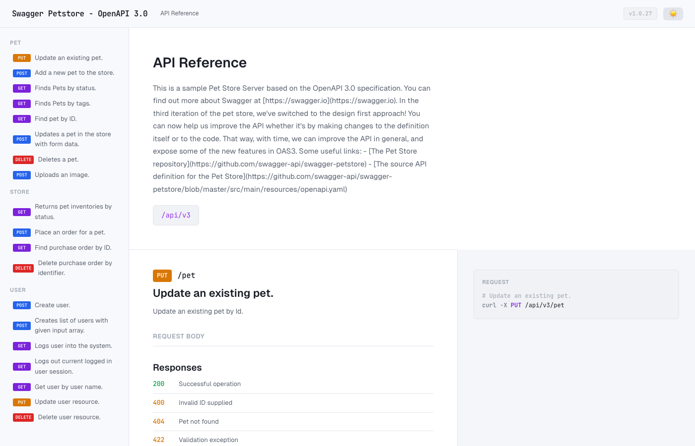

<div align="center">
  <h1>swagger-stripey</h1>
  <p><strong>Stripe-style API docs from any OpenAPI spec. One HTML file. Zero dependencies.</strong></p>
  <p>
    <a href="https://opensource.org/licenses/MIT"></a>
    <a href="#"></a>
    <a href="#"></a>
  </p>
</div>

<br/>

Drop a single HTML file next to your `openapi.json` and get beautiful three-panel API docs — sidebar navigation, parameter tables, curl examples, response previews, dark/light mode, fully responsive.

No build step. No npm install. No React. No paid SaaS branding in the footer.

## Origin

Extracted from [camofox-browser](https://github.com/jo-inc/camofox-browser), where we needed API docs that didn't come with paid product branding.

## Quick Start

```bash
# Copy index.html next to your OpenAPI spec
curl -O https://raw.githubusercontent.com/skyfallsin/swagger-stripey/main/index.html

# Open it
open index.html
# or serve it
python3 -m http.server 8080
```

That's it. It reads `./openapi.json` by default.

## Screenshots

Dark mode:



Light mode:



## Customization

Everything is configured via a single `<script>` tag in `<head>`:

```html
<script id="docs-config" type="application/json">
{
  "specUrl": "./openapi.json",
  "logoUrl": "./logo.png",
  "title": "My API",
  "subtitle": "API Reference",
  "defaultTheme": "dark",
  "accent": "#9B30FF",
  "accentLight": "#B366FF",
  "bgPrimary": "#070E1A",
  "bgSecondary": "#0B1628",
  "bgTertiary": "#0F1D33",
  "textPrimary": "#E8F0FF",
  "textSecondary": "#8BA3C7",
  "fontBody": "'Inter', sans-serif",
  "fontMono": "'Fira Code', monospace",
  "methodGet": "#9B30FF",
  "methodPost": "#2563EB",
  "methodDelete": "#DC2626"
}
</script>
```

All fields are optional. Sensible defaults kick in for anything you don't set.

### Config Reference

| Key | Default | Description |
|-----|---------|-------------|
| `specUrl` | `./openapi.json` | Path or URL to your OpenAPI 3.x spec |
| `logoUrl` | none | Logo image URL shown in the header |
| `title` | from spec `info.title` | Override the title in the header |
| `subtitle` | `API Reference` | Subtitle shown next to the title |
| `defaultTheme` | `dark` | Initial theme: `dark` or `light` |
| `accent` | `#9B30FF` | Primary accent color |
| `accentLight` | `#B366FF` | Light accent (params, links) |
| `bgPrimary` | `#070E1A` | Main background |
| `bgSecondary` | `#0B1628` | Sidebar/header background |
| `bgTertiary` | `#0F1D33` | Code blocks, inputs |
| `textPrimary` | `#E8F0FF` | Primary text color |
| `textSecondary` | `#8BA3C7` | Secondary text color |
| `fontBody` | Geist, system | Body font stack |
| `fontMono` | JetBrains Mono | Code/mono font stack |
| `methodGet` | `#9B30FF` | GET badge color |
| `methodPost` | `#2563EB` | POST badge color |
| `methodDelete` | `#DC2626` | DELETE badge color |
| `methodPut` | `#D97706` | PUT badge color |
| `methodPatch` | `#0891B2` | PATCH badge color |

You can also set config via `window.docsConfig` before the page loads:

```html
<script>
window.docsConfig = {
  specUrl: 'https://api.example.com/openapi.json',
  title: 'Example API',
  accent: '#FF6600',
};
</script>
```

### Programmatic / JS config

For frameworks or build tools, set `window.docsConfig` before including the script:

```html
<script>
window.docsConfig = { specUrl: '/api/openapi.json', title: 'My API' };
</script>
<script src="swagger-stripey.js"></script>
```

## Features

- **Three-panel layout** — sidebar nav, descriptions + params, code examples
- **Dark & light mode** — toggle in header, persisted to localStorage
- **Fully responsive** — three-panel on desktop, stacked on tablet, collapsible sidebar on mobile
- **Curl examples** — auto-generated from your spec with syntax highlighting
- **Response previews** — JSON scaffolded from response schemas
- **Active nav tracking** — IntersectionObserver highlights current endpoint
- **Tag grouping** — operations grouped and ordered by OpenAPI tags
- **Deprecated badges** — clearly marked deprecated endpoints
- **Path param highlighting** — `{tabId}` params colored in endpoint paths
- **Security indicators** — shows which endpoints require auth
- **Zero runtime dependencies** — one HTML file, fonts from Google CDN
- **No branding** — no "powered by" footer, no paid product upsell

## Fonts

By default, swagger-stripey loads [Geist](https://vercel.com/font) and [JetBrains Mono](https://www.jetbrains.com/lp/mono/) from Google Fonts. To use different fonts:

1. Add your font `<link>` tags to the HTML `<head>`
2. Set `fontBody` and/or `fontMono` in the config

```html
<link href="https://fonts.googleapis.com/css2?family=Inter:wght@400;500;600&display=swap" rel="stylesheet">
<script id="docs-config" type="application/json">
{
  "fontBody": "'Inter', sans-serif"
}
</script>
```

## Hosting

swagger-stripey is static HTML — host it anywhere:

- **GitHub Pages** — drop `index.html` + `openapi.json` in a repo, enable Pages
- **Netlify / Vercel** — same, zero config
- **S3 / CloudFront** — upload both files
- **Your Express server** — `app.use('/docs', express.static('docs/'))`

## How It Works

The page fetches your `openapi.json`, parses paths/operations/schemas, and renders everything client-side. No server-side processing, no build step, no bundler.

The IntersectionObserver API tracks which endpoint is in view and highlights the corresponding sidebar item. Theme preference is persisted to `localStorage`.

## Browser Support

Modern browsers (Chrome, Firefox, Safari, Edge). Uses CSS custom properties, `fetch`, `IntersectionObserver`, template literals. No IE11.

## License

MIT
